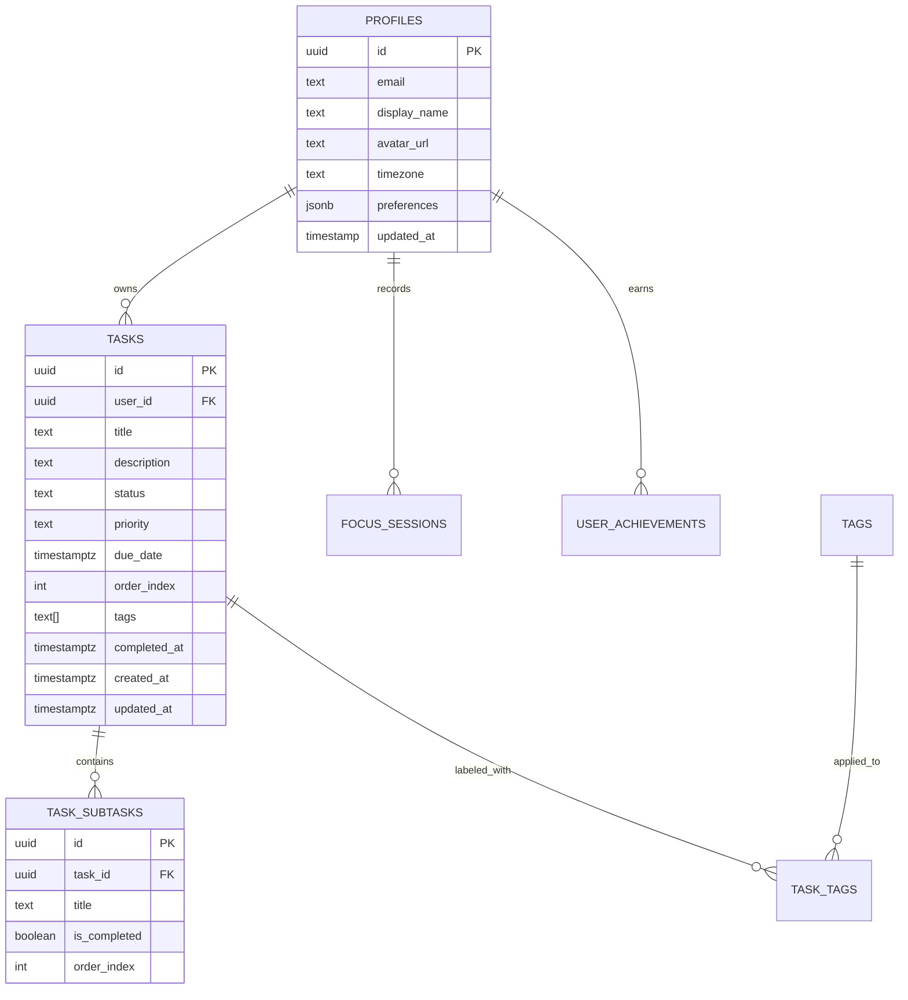

# Toki — "Make progress feel good."

A human-centered personal productivity application engineered with a tactile, analog-notebook aesthetic and backed by a modern PostgreSQL cloud architecture.

Toki balances mindful task management, tactile micro-interactions, an animated mascot companion (*Toki*), and multi-device cloud synchronization via **Supabase**.

---

## 🌟 Key Features

### 1. Multi-Device Cloud Sync & Authentication (V3)
- **Supabase Authentication**: Secure email & password sign up, login, password recovery, and automatic session persistence.
- **Relational PostgreSQL Schema**: Normalized tables for `profiles`, `tasks`, `task_subtasks`, `tags`, `task_tags`, `focus_sessions`, and `user_achievements`.
- **Row Level Security (RLS)**: Strict database policies ensuring users can only read, insert, update, and delete their own data.
- **Supabase Realtime**: Instant synchronization of tasks, completions, and edits across multiple browser tabs and devices.
- **Optimistic UI with Automatic Rollback**: Instant user responsiveness with graceful rollback and error alerts if cloud mutations fail.
- **Local-to-Cloud Migration**: Seamless one-click migration prompt when signing in with existing offline/guest tasks.
- **Graceful Offline / Guest Mode**: Works seamlessly without credentials or if offline, falling back cleanly to `localStorage`.

### 2. Rich Task Management (V1 & V2)
- **Smart Views**: Inbox, Today, Upcoming (calendar schedule), Completed archive, and Kanban boards.
- **Subtasks & Checklists**: Expandable nested subtasks with progress tracking.
- **Tagging & Priority**: Color-coded categorization and 3-tier priority weighting.
- **Search & Filters**: Fuzzy search, tag filtering, and priority sorting.
- **Keyboard Shortcuts**: Instant quick actions (`N` for new task, `F` for focus, `K` for kanban, `Cmd/Ctrl+K` for command palette, `/` for search).

### 3. Focus & Productivity Companion
- **Toki Mascot**: An animated SVG companion that reacts dynamically to your actions, streaks, and work states (Idle, Working, Celebrating, Resting, Cheering).
- **Pomodoro Focus Timer**: Configurable work/break intervals with ambient sounds (Rain, Forest, Cafe, White Noise) and browser notifications upon session completion.
- **Analytics & Streaks**: Weekly productivity distribution, completion velocity, and streak tracking.

---

## 🛠️ Architecture & Tech Stack

- **Frontend**: React 18, JavaScript (ES6+), Vite.
- **Styling**: Vanilla CSS with custom design tokens, CSS custom properties, and dark mode support.
- **Icons**: [Lucide React](https://lucide.dev/).
- **Animation**: [Framer Motion](https://www.framer.com/motion/) & CSS keyframe physics.
- **Routing**: React Router v6.
- **Backend & Database**: [Supabase](https://supabase.com/) (PostgreSQL, GoTrue Auth, Realtime WebSocket engine).
- **Data Access Layer**: Clean separation of UI from API calls via `src/services/` (`tasks.js`, `auth.js`, `profile.js`, `focus.js`, `notifications.js`).

---

## 🚀 Getting Started

### 1. Prerequisites
- [Node.js](https://nodejs.org/) (v18 or higher recommended)
- npm or pnpm

### 2. Installation

Clone the repository and install dependencies:
```bash
git clone https://github.com/your-username/toki.git
cd toki
npm install
```

### 3. Setting Up Supabase

1. Create a free project on [Supabase.com](https://supabase.com/).
2. In your Supabase project dashboard, navigate to the **SQL Editor**.
3. Open the file [`supabase/schema.sql`](supabase/schema.sql) in this repository, paste its contents into the SQL Editor, and run it.
   - This creates all necessary tables (`profiles`, `tasks`, `task_subtasks`, etc.).
   - This configures Row Level Security (RLS) policies.
   - This registers automated triggers for profile creation and timestamp updating.
   - This adds `tasks` and `task_subtasks` to the `supabase_realtime` publication.
4. Go to **Project Settings** -> **API** in Supabase and copy:
   - **Project URL**
   - **anon / public key**

### 4. Environment Variables

Copy the example environment file:
```bash
cp .env.example .env
```

Open `.env` and fill in your Supabase credentials:
```env
VITE_SUPABASE_URL=https://your-project-id.supabase.co
VITE_SUPABASE_ANON_KEY=eyJhbGciOiJIUzI1NiIsInR5cCI6IkpXVCJ9...
```

> **Note**: If you run Toki without setting these keys, the application automatically boots into **Offline / Guest Mode**, allowing complete local functionality using `localStorage`.

### 5. Running Locally

Start the Vite development server:
```bash
npm run dev
```
Open your browser and navigate to `http://localhost:5173`.

### 6. Production Build

To build the static production bundle:
```bash
npm run build
npm run preview
```

---

## 🗄️ Database Schema & Security

The complete relational schema with RLS policies is defined in [`supabase/schema.sql`](supabase/schema.sql).

### Key Entities



### Row Level Security (RLS)
All tables enforce PostgreSQL RLS policies ensuring isolation between user accounts:
```sql
ALTER TABLE public.tasks ENABLE ROW LEVEL SECURITY;

CREATE POLICY "Users can manage own tasks" 
  ON public.tasks 
  FOR ALL 
  USING (auth.uid() = user_id)
  WITH CHECK (auth.uid() = user_id);
```

---

## 🚢 Deployment (Vercel / Netlify)

Toki is a static client-side SPA and can be deployed with zero server maintenance:

1. Push your code to GitHub.
2. Import the repository in [Vercel](https://vercel.com) or [Netlify](https://netlify.com).
3. Set the Framework Preset to **Vite**.
4. In the Environment Variables section, add:
   - `VITE_SUPABASE_URL`
   - `VITE_SUPABASE_ANON_KEY`
5. Deploy! Your app will be live with instant global CDN caching and SSL.

---

## 📄 License

MIT License. Crafted with care to make progress feel good.
